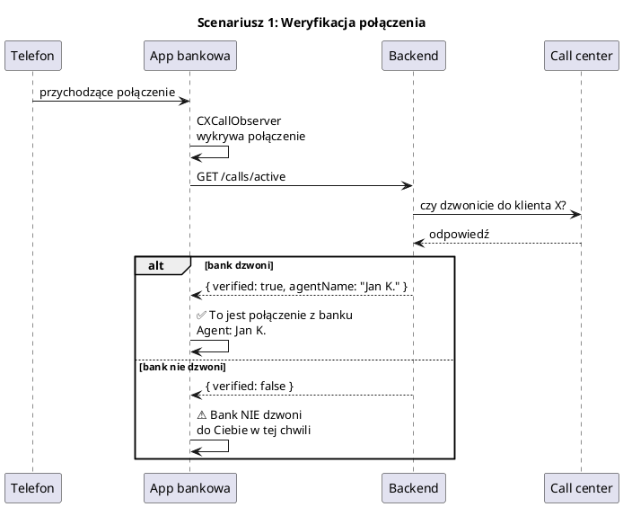
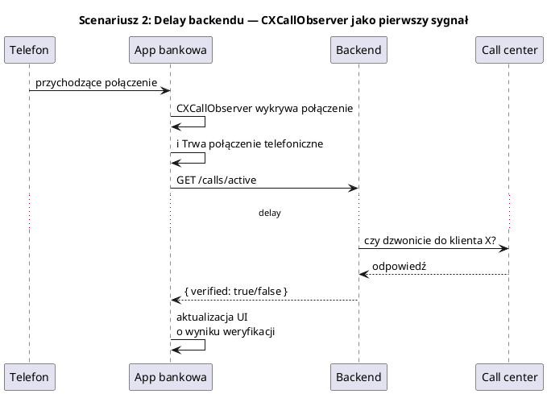

# Flow — weryfikacja połączenia telefonicznego

## Scenariusz 1: Weryfikacja połączenia

```plantuml
@startuml
title Scenariusz 1: Weryfikacja połączenia

participant "Telefon" as phone
participant "App bankowa" as app
participant "Backend" as backend
participant "Call center" as cc

phone -> app : przychodzące połączenie
app -> app : CXCallObserver\nwykrywa połączenie
app -> backend : GET /calls/active
backend -> cc : czy dzwonicie do klienta X?
cc --> backend : odpowiedź

alt bank dzwoni
    backend --> app : { verified: true, agentName: "Jan K." }
    app -> app : ✅ To jest połączenie z banku\nAgent: Jan K.
else bank nie dzwoni
    backend --> app : { verified: false }
    app -> app : ⚠️ Bank NIE dzwoni\ndo Ciebie w tej chwili
end

@enduml
```

---

## Scenariusz 2: Delay backendu — CXCallObserver jako pierwszy sygnał

```plantuml
@startuml
title Scenariusz 2: Delay backendu — CXCallObserver jako pierwszy sygnał

participant "Telefon" as phone
participant "App bankowa" as app
participant "Backend" as backend
participant "Call center" as cc

phone -> app : przychodzące połączenie
app -> app : CXCallObserver wykrywa połączenie
app -> app : ℹ️ Trwa połączenie telefoniczne
app -> backend : GET /calls/active

...delay...

backend -> cc : czy dzwonicie do klienta X?
cc --> backend : odpowiedź
backend --> app : { verified: true/false }
app -> app : aktualizacja UI\no wyniku weryfikacji

@enduml
```
